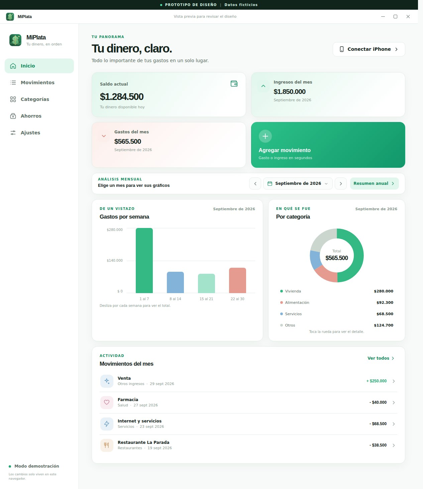
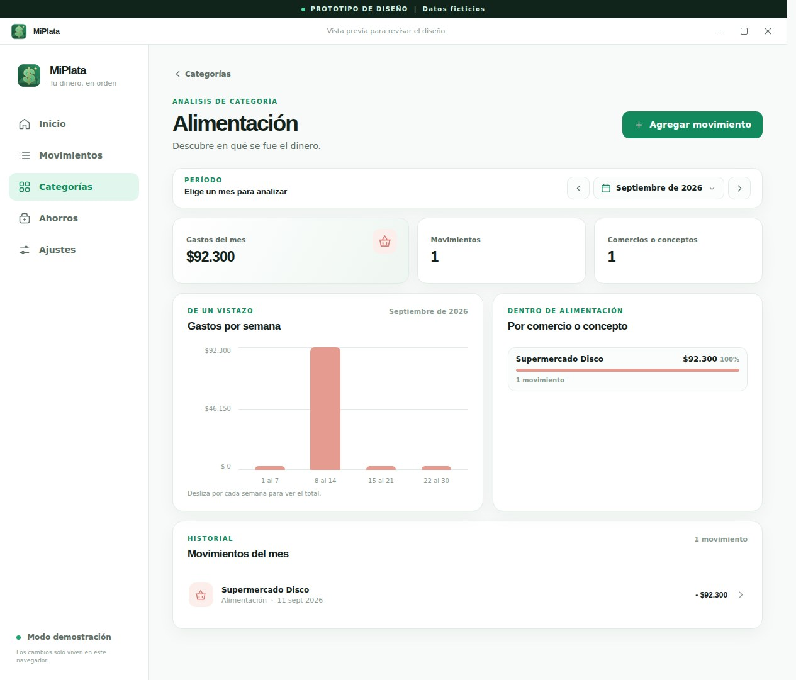
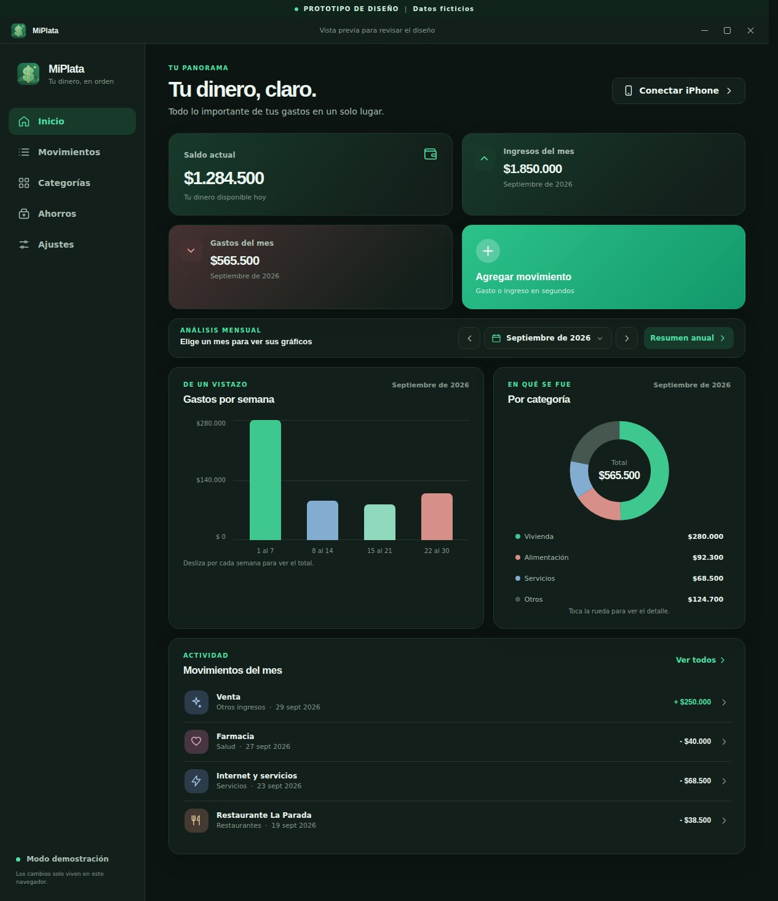
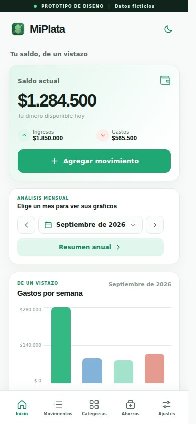
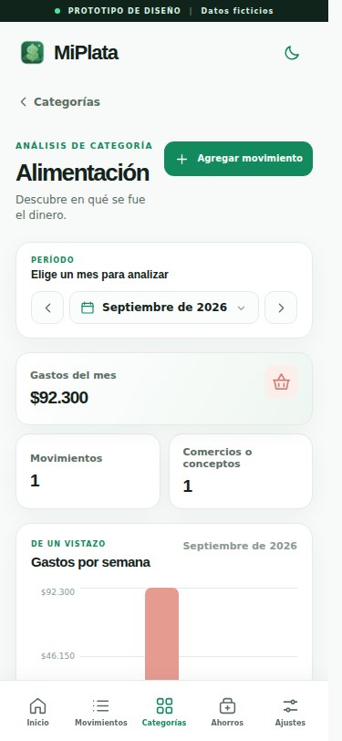
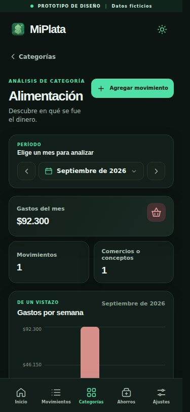

<p align="center"></p>

<h1 align="center">MiPlata</h1>

<p align="center">Tus movimientos, categorías y ahorros en un solo lugar.</p>

<p align="center"><a href="https://github.com/xdeveloping21/MiPlata/releases/latest"><strong>Descargar para Windows</strong></a> · <a href="#capturas">Ver capturas</a> · <a href="LICENSE">Licencia MIT</a></p>

MiPlata es una aplicación de escritorio para Windows. Guarda los datos en SQLite en tu PC y permite consultarlos y editarlos desde Safari en un iPhone vinculado por QR. No requiere crear una cuenta.

## Sobre MiPlata

MiPlata es un fork de [MisGastos](https://github.com/ValentinTarnovsky/MisGastos), creado por Valentin Tarnovsky y publicado con licencia MIT. Se basa en MisGastos 0.2.8 y cambia lo siguiente:

- Logo propio: un signo $ verde con estrella, montañas y araucaria (fuente en `assets/miplata-logo.svg`).
- Textos en español neutro (tú) en la app y en la vinculación del iPhone.
- Moneda principal en pesos chilenos (CLP), con formato `es-CL`.
- Los campos de monto muestran el punto de miles mientras escribes (10.000, 1.000.000).
- Estética verde menta en modo claro y oscuro, a juego con el logo.
- Sin el bot de Discord del original: MiPlata no se conecta a Discord ni ejecuta Claude Code.
- Filtros por rango de fechas y de montos en Movimientos, con el total de gastos e ingresos de lo filtrado.
- Foto de la boleta o captura de pantalla opcional en cada movimiento.
- Archivo opcional de factura o documento (PDF, Excel, Word, CSV, XML o TXT, hasta 15 MB) en cada movimiento. En la PC se abre con el programa que tengas para ese tipo de archivo.
- Las imágenes y los archivos se guardan en las carpetas `receipts` y `documents` de los datos de MiPlata, en tu PC, y no se incluyen en la copia JSON exportada.
- Si MisGastos estaba instalado, MiPlata copia sus datos en el primer inicio, sin borrar ni modificar los originales. También restaura copias JSON de MisGastos; los ahorros en ARS se leen como CLP.

MiPlata usa el mismo puerto (`4174`) que MisGastos, así que no pueden estar abiertos al mismo tiempo. Si tenías MisGastos, desinstálalo después de comprobar que tus datos aparecen en MiPlata.

## Qué puedes hacer

- Registrar ingresos y gastos en pesos chilenos (CLP), con saldo inicial y categorías propias.
- Editar, borrar, recategorizar y buscar movimientos. Inicio y Movimientos muestran primero los cargados más recientemente, aunque su fecha de gasto sea anterior o futura.
- Reutilizar descripciones con sugerencias basadas en compras anteriores de la misma categoría. Un campo de detalle opcional distingue cada compra.
- Ver gráficos por mes, resumen anual y análisis de cada categoría por comercio o concepto. Los nombres duplicados se pueden unir.
- Registrar ahorros en CLP o USD. Para compras de dólares, anotas también el importe pagado en CLP.
- Cambiar entre tema claro y oscuro. La interfaz se adapta a PC e iPhone.
- Exportar, restaurar y conservar copias locales automáticas.
- Vincular un iPhone con un QR temporal, aprobarlo desde la PC y revocar el acceso cuando quieras.

## Capturas

Las capturas usan **datos ficticios** de la vista de demostración. Tus datos reales empiezan vacíos.

### Escritorio



<details>
<summary>Ver análisis por categoría y tema oscuro</summary>





</details>

### iPhone

<table>
  <tr>
    <td align="center"><strong>Inicio</strong></td>
    <td align="center"><strong>Categoría</strong></td>
    <td align="center"><strong>Modo oscuro</strong></td>
  </tr>
  <tr>
    <td></td>
    <td></td>
    <td></td>
  </tr>
</table>

## Instalar en Windows

1. Descarga el instalador desde [la última versión](https://github.com/xdeveloping21/MiPlata/releases/latest).
2. Ejecútalo y abre **MiPlata** desde el acceso directo del escritorio o el menú Inicio.
3. En **Ajustes**, carga tu saldo inicial en CLP. Después agrega tus movimientos.

El instalador todavía no tiene un certificado de firma comercial, por lo que Windows puede mostrar "Editor desconocido". Descárgalo desde este repositorio y, si quieres verificarlo, compara su SHA-256 con el publicado en la versión.

La primera apertura muestra la ventana. En los siguientes inicios de Windows, MiPlata se inicia oculto y queda en la bandeja, bajo la flecha junto al reloj. Al cerrar la ventana sigue funcionando en segundo plano. Desde el icono de la bandeja puedes abrirla, activar o desactivar el inicio con Windows y salir por completo.

## Vincular un iPhone

1. Mantén la PC encendida, con sesión iniciada y sin suspensión.
2. En MiPlata para Windows, abre **Conectar iPhone**.
3. Elige la dirección de tu Wi-Fi si ambos equipos comparten la red, o la dirección de Tailscale si vas a usarlo fuera de casa.
4. Escanea el QR con el iPhone y abre el enlace en Safari.
5. Aprueba la solicitud que aparece en la PC. En Safari puedes usar **Compartir > Agregar a Inicio** para crear el acceso directo con el logo.

El QR vence a los cinco minutos. Los celulares vinculados aparecen en **Ajustes** y se pueden revocar. El acceso móvil usa el servidor local de la PC en el puerto `4174`. No abras ese puerto a Internet; para acceder fuera de casa, usa Tailscale en ambos dispositivos. El iPhone accede mediante Safari, mientras que la aplicación instalada se ejecuta en Windows.

## Datos y copias

- Base de datos: `%APPDATA%\MiPlata\miplata.sqlite`.
- Copias automáticas: `%APPDATA%\MiPlata\backups\`.
- Diagnóstico: `%APPDATA%\MiPlata\logs\`, también accesible desde **Abrir registros** en el icono de la bandeja. Se guarda un archivo por día con arranques, cierres y errores. La app conserva siete días y limita cada archivo a 1 MB. Un aviso de cierre no registrado indica que la sesión anterior terminó sin pasar por el cierre normal; por sí solo no confirma un crash.
- Exportación y restauración: **Ajustes > Copias de seguridad**.

La base de datos, las copias y los dispositivos vinculados permanecen en tu PC. No están incluidos en este repositorio ni en el instalador. Si cambias de PC, exporta una copia JSON desde Ajustes y restáurala en la nueva instalación.

## Desarrollar o compilar

Probado en Windows 11 x64 con Node.js 24 y npm 11.

```powershell
npm ci
npm start
```

Para generar la carpeta ejecutable o el instalador:

```powershell
npm run build:win
npm run build:release
```

`build:win` deja una versión ejecutable en `dist/win-unpacked/`. `build:release` genera el instalador de Windows en `dist/`. La app usa Electron para la ventana y la bandeja, un servidor HTTP local para el iPhone y SQLite para persistencia. La interfaz está escrita en JavaScript y CSS sin un servicio en la nube.

## Licencia

MiPlata se distribuye bajo la [licencia MIT](LICENSE). Los iconos de Lucide conservan su [licencia ISC](assets/lucide-license.txt).
